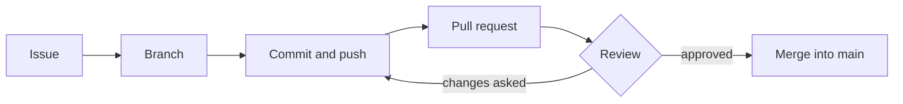
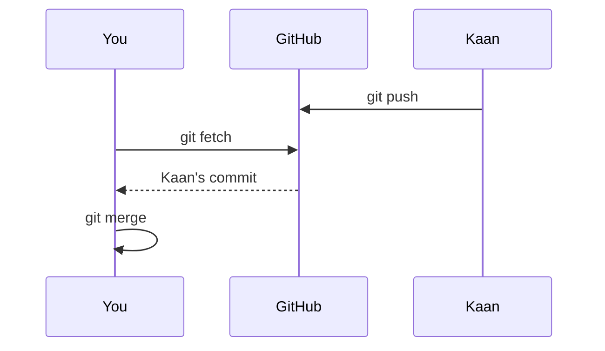

# How a change reaches main

```mermaid
flowchart LR
    A[Issue] --> B[Branch]
    B --> C[Commit and push]
    C --> D[Pull request]
    D --> E{Review}
    E -- changes asked --> C
    E -- approved --> F[Merge into main]
```

## Who talks to whom

```mermaid
sequenceDiagram
    participant You
    participant GitHub
    participant Kaan
    Kaan->>GitHub: git push
    You->>GitHub: git fetch
    GitHub-->>You: Kaan's commit
    You->>You: git merge
```
